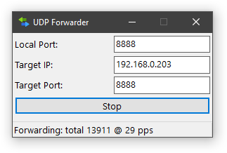

# UDP Forwarder

A lightweight Windows GUI application that forwards UDP packets from a local port to a specified target address. Designed for low-latency, high-throughput scenarios such as racing game telemetry streams.



## Features

- Minimize to system tray
- Registry-based configuration persistence
- Command-line support for scripted startup

## Usage

### GUI Mode

1. Enter the **local port** to listen on (default: `8888`).
2. Enter the **target IP** address (default: `192.168.0.1`).
3. Enter the **target port** (default: `8888`).
4. Click **Start** to begin forwarding.
5. Click **Stop** to halt forwarding.
6. Minimize to system tray; right-click the tray icon for *Show* / *Exit*.

### Command Line

```
udpfwd.exe -l 8888 -t 192.168.0.10:8888 -a
```

| Option                   | Description                            |
|--------------------------|----------------------------------------|
| `-l, --local-port`       | Local port to listen on                |
| `-t, --target`           | Target address (e.g. `192.168.0.10:80`) |
| `-a, --auto-start`       | Auto-start forwarding on launch        |

## Build

See [BUILD.md](./BUILD.md) for prerequisites and build instructions.